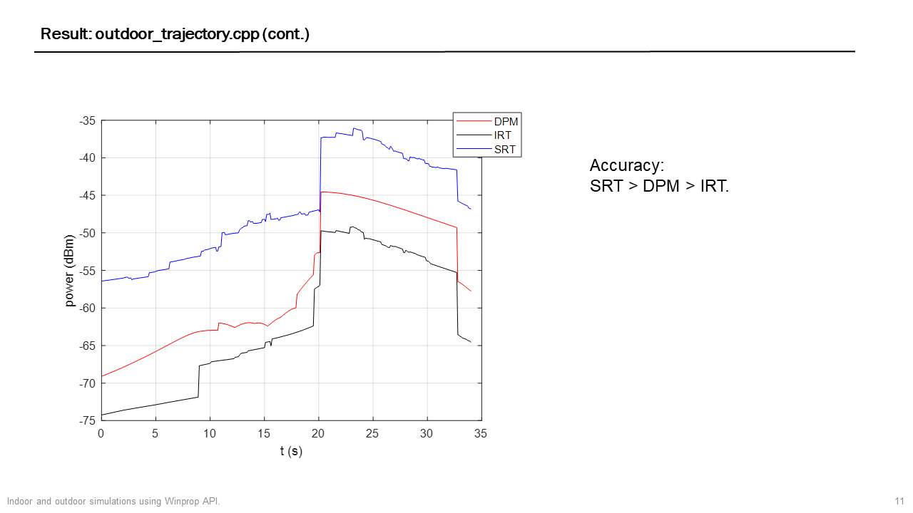

## testWinProp

==Run the programs again to produce the simulation results.==

+ Simulation goal: simulate the channel variations and received power variations due to impacts of moving objects or moving RXs.

+ Environment settings: `MSVC(VS 2019)` + `Clion 2021` + `WinProp API 2021 for windows`. Use `CMakeLists.txt` to compile the project.

+ Two simulation schemes:
    + Time variant prediction. 
      + Can only add time-variant components in `.idb`
      + Generate the prediction result on the whole "map" at each time instance.
    + Trajectory prediction. 
      + Could use C++ command to control.
      + Generate the prediction result along the trajectory.
    
+ Simulation scenarios:
  
  |                | Indoor                                                   | Outdoor (Urban)                                              |
  | -------------- | -------------------------------------------------------- | ---------------------------------------------------- |
  | Trajectory     | [indoor_trajectory.cpp](./indoor_trajectory.cpp)         | [outdoor_trajectory.cpp](outdoor_trajectory.cpp) |
  | Time variant | [indoor_time_variant.cpp](./indoor_time_variant.cpp) | Not completed yet (Treated as indoor.)                |
  | Ray-Tracing    | SRT                                                      | SRT & DPM & IRT                                      |
  
+ Go to [test_database](./data/test_database) to see designed databases in this project.

+ Simulation settings:

    |                                                          | TX (10W)          | RX          | Ray-Tracing | Specifications     | Prediction Height |
    | -------------------------------------------------------- | ----------- | ----------- | ----------- | ------------------ | ---------------- |
    | [indoor_trajectory.cpp](./indoor_trajectory.cpp)         | omni, 1.25m, 2000 MHz | omni, 1.25m | SRT         | 1m/s RX            | 1.25m            |
    | [indoor_time_variant.cpp](./indoor_time_variant.cpp) | omni, 1.25m, 2000 MHz | omni, 1.25m | SRT         | 1m/s Moving Object | 1.25m            |
    | [outdoor_trajectory.cpp](outdoor_trajectory.cpp)     | omni, 15m, 2000 MHz | omni, 1.5m| DPM, SRT (Treated as indoor), IRT (Preprocess the database) | 10m/s moving RX | 1.5m |
    | Time variant scenario in outdoor (Not completed yet.)                                                       |             |             |             |                    |                  |
>  We could import the exported data into `MATLAB` to do further processing.
 + Remaining problems:
    + Time-variant scenario in outdoor (urban) database.
    + Add directional antenna to RX.
    + Material settings. See [./data/test_database/记录.md](./data/test_database/记录.md).

## Simulation Result (via MATLAB postprocessing.)

### `Indoor_time_variant.cpp`

+ Ray-Tracing result:

  

+ Channel Impulse Response at pixel [3.5m:3.75m, 0m:0.25m]:

  

### `indoor_trajectory.cpp`

### `outdoor_trajectory.cpp`

## See More details

+ Look at [2021_7_12.pptx](./2021_7_12.pptx) for detailed results and c++ environment settings.

