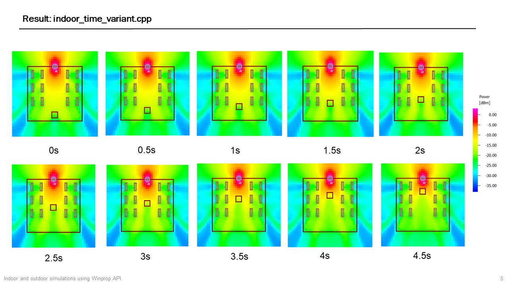

<https://user-images.githubusercontent.com/66763689/203083483-530bdf29-da8b-409d-a54a-a99da708b16f.mov>

## testWinProp

**Run the programs again to produce the simulation results.**

+ Simulation goal: simulate the channel variations and received power variations due to impacts of moving objects or moving RXs.

+ Environment settings: `MSVC(VS 2019)` + `Clion 2021/2023` + `WinProp API 2021/2022 for windows`. Use `CMakeLists.txt` to compile the project.

+ Two simulation schemes:
    + Time variant prediction. 
      + Can only add time-variant components in `.idb`
      + Generate the prediction result on the whole "map" at each time instance.
    + Trajectory prediction. 
      + Could use C++ command to control.
      + Generate the prediction result along the trajectory.
    
+ Simulation scenarios:
  
  |                | Indoor                                                   | Outdoor (Urban)                                              |
  | -------------- | -------------------------------------------------------- | ---------------------------------------------------- |
  | Trajectory     | [indoor_trajectory_str/_csv.cpp](./indoor_trajectory_csv.cpp) | [outdoor_trajectory.cpp](outdoor_trajectory.cpp) |
  | Time variant | [indoor_time_variant.cpp](./indoor_time_variant.cpp) | Not completed yet (Treated as indoor.)                |
  | Ray-Tracing    | SRT                                                      | SRT & DPM & IRT                                      |
  
+ Go to [test_database](./data/test_database) to see designed databases in this project.

+ Simulation settings:

    |                                                          | TX (10W)          | RX          | Ray-Tracing | Specifications                                                                                            | Prediction Height |
    | -------------------------------------------------------- | ----------- | ----------- | ----------- |-----------------------------------------------------------------------------------------------------------| ---------------- |
    | [indoor_trajectory_str.cpp](./indoor_trajectory_str.cpp) | omni, 1.25m, 2000 MHz | omni, 1m | SRT | 2.5m/s RX and 0.5m/s Moving Object (The direction of the motion is 45 degrees in the x and y coordinates) | 1m |
    | [indoor_trajectory_csv.cpp](./indoor_trajectory_csv.cpp)     | omni, 1.25m, 2000 MHz | omni, 1m | SRT         | 2.5m/s RX and 0.5m/s Moving Object (Same as above)                                                        | 1m            |
    | [indoor_time_variant.cpp](./indoor_time_variant.cpp) | omni, 1.25m, 2000 MHz | omni, 1m | SRT         | 0.5m/s Moving Object (Same as above)                                                                      | 1m            |
    | [outdoor_trajectory.cpp](outdoor_trajectory.cpp)     | omni, 15m, 2000 MHz | omni, 1.5m| DPM, SRT (Treated as indoor), IRT (Preprocess the database) | 10m/s moving RX                                                                                           | 1.5m |
    | Time variant scenario in outdoor (Not completed yet.)                                                       |             |             |             |                                                                                                           |                  |

- Notes:
  - The **difference between indoor_trajectory_str.cpp and indoor_trajectory_csv.cpp** is that the multipath attribute of every sampling point on the path that in indoor_trajectory_str.cpp **is in the** [.str file](./data/indoor_trajectory_str/TX Rays.str) **format**, which is not easy to find and analyze. However, **indoor_trajectory_csv.cpp is to use the** [.csv file ](./data/indoor_trajectory_csv/CIR.csv )**to show the multipath properties of all sampling points in the path at different times**, so that we can easily view and further analyze the multipath properties (such as Delay, Doppler frequency, AOA , AOD etc).
  - We could import the exported data into `MATLAB` to do further processing.
 + Remaining problems:
    + Time-variant scenario in outdoor (urban) database.
    + Add directional antenna to RX.
    + Material settings. See [./data/test_database/记录.md](./data/test_database/记录.md).

## Simulation Result (via MATLAB postprocessing.)

### `Indoor_time_variant.cpp`

+ Ray-Tracing result:

  

### `indoor_trajectory.cpp`

### `outdoor_trajectory.cpp`

## See More details

+ Look at [2021_7_12.pptx](./2021_7_12.pptx) for detailed results and c++ environment settings.

